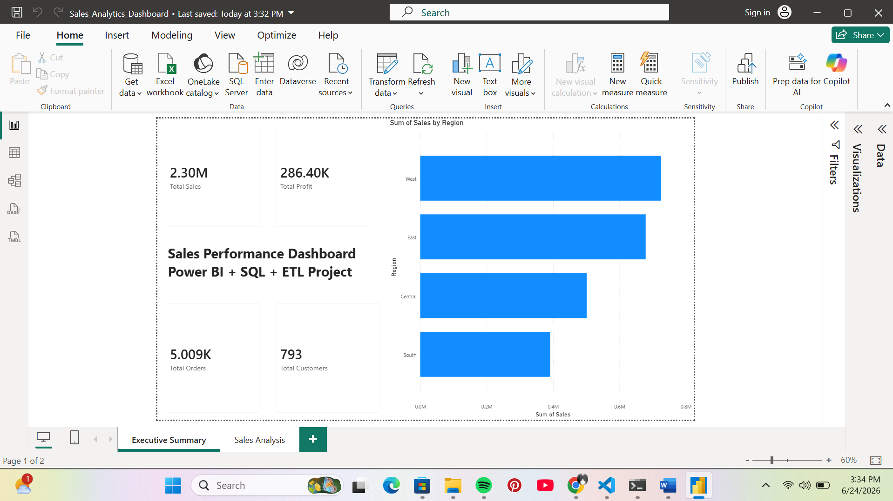
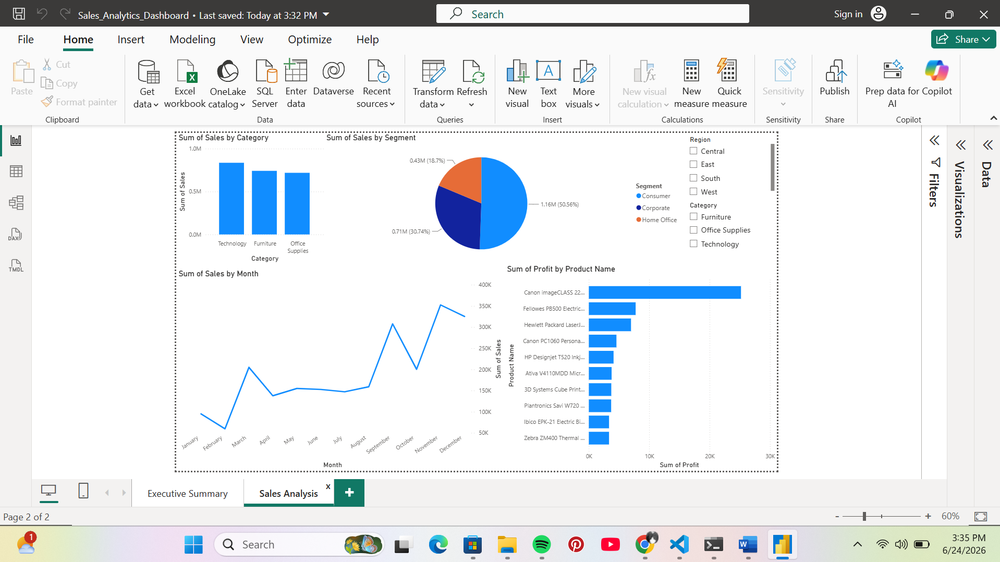

# Sales ETL Pipeline, Data Warehouse & Power BI Dashboard

## Author

**Tanushree Ambade**

---

# Project Overview

This project demonstrates an end-to-end Data Engineering workflow using Python, Pandas, PostgreSQL, SQL, and Power BI.

The Superstore Sales Dataset was used to build a complete ETL pipeline, design a Star Schema Data Warehouse, perform SQL-based business analysis, and create an interactive Power BI dashboard for data visualization.

### Key Objectives

* Extract and clean raw sales data
* Transform data into business-ready format
* Load data into PostgreSQL
* Design a Star Schema Data Warehouse
* Perform SQL analytics
* Build an interactive Power BI dashboard

---

# Technologies Used

* Python
* Pandas
* SQL
* PostgreSQL
* SQLAlchemy
* Power BI
* Git
* GitHub

---

# Project Architecture

```text
Raw Sales Data
       ↓
Data Cleaning & Transformation
       ↓
PostgreSQL Database
       ↓
Star Schema Data Warehouse
       ↓
SQL Analytics
       ↓
Power BI Dashboard
```

---

# Project Structure

```text
Sales_ETL_Project
│
├── data
│   └── Sample - Superstore.csv
│
├── output
│   ├── clean_sales.csv
│   ├── customer_dim.csv
│   ├── product_dim.csv
│   └── fact_sales.csv
│
├── scripts
│   ├── check_data.py
│   ├── data_profile.py
│   ├── transform_data.py
│   ├── revenue_analysis.py
│   ├── category_analysis.py
│   ├── customer_analysis.py
│   ├── star_schema.py
│   ├── load_to_postgres.py
│   └── load_star_schema.py
│
├── screenshots
│
├── Sales_Analytics_Dashboard.pbix
│
└── README.md
```

---

# ETL Pipeline

## Extract

Loaded the Superstore Sales Dataset using Pandas.

## Transform

Performed:

* Data Cleaning
* Missing Value Validation
* Data Profiling
* Revenue Calculation
* Profit Margin Calculation

## Load

Loaded transformed data into PostgreSQL.

Main Table:

```sql
sales_data
```

---

# Star Schema Design

## Fact Table

### fact_sales

* Order ID
* Customer ID
* Product ID
* Sales
* Quantity
* Discount
* Profit

## Dimension Tables

### customer_dim

* Customer ID
* Customer Name
* Segment
* City
* State
* Region

### product_dim

* Product ID
* Product Name
* Category
* Sub-Category

---

# SQL Analytics

## Regional Revenue Analysis

| Region  | Revenue |
| ------- | ------- |
| West    | 764,634 |
| East    | 611,734 |
| Central | 518,800 |
| South   | 402,031 |

### Screenshot


---

## Top Customers by Profit

| Customer      | Profit |
| ------------- | ------ |
| Tamara Chand  | 8,981  |
| Raymond Buch  | 6,976  |
| Sanjit Chand  | 5,757  |
| Hunter Lopez  | 5,622  |
| Adrian Barton | 5,444  |

---

## Top Products by Profit

| Product                               | Profit |
| ------------------------------------- | ------ |
| Canon imageCLASS 2200 Advanced Copier | 25,199 |
| Fellowes PB500 Binding Machine        | 7,753  |
| Hewlett Packard LaserJet 3310 Copier  | 6,983  |

### Screenshot


---

## Monthly Sales Trend

### Key Observation

Highest Monthly Sales:

**November 2017 → $118,447.83**

---

# Power BI Dashboard

An interactive Power BI dashboard was developed on top of the PostgreSQL Data Warehouse to visualize business performance and sales insights.

## Dashboard Features

* KPI Cards (Sales, Profit, Orders, Customers)
* Region-wise Revenue Analysis
* Category-wise Sales Analysis
* Monthly Sales Trend
* Segment-wise Sales Distribution
* Top 10 Profitable Products
* Interactive Region & Category Filters

---

## Executive Summary Dashboard



---

## Sales Analysis Dashboard



---

# Database Verification

```sql
SELECT COUNT(*) FROM sales_data;
```

Result:

```text
9994 Rows
```

---

# Additional Screenshots

## PostgreSQL Tables


## Revenue Analysis


## GitHub Repository


---

# Future Improvements

* Apache Airflow Automation
* Cloud Deployment (AWS/GCP)
* Data Pipeline Scheduling
* Advanced Business KPIs
* Real-Time Data Ingestion

---

# Conclusion

This project demonstrates a complete Data Engineering workflow from raw data extraction and transformation to PostgreSQL loading, Star Schema Data Warehousing, SQL Analytics, and Power BI Dashboard development using industry-standard tools and practices.
