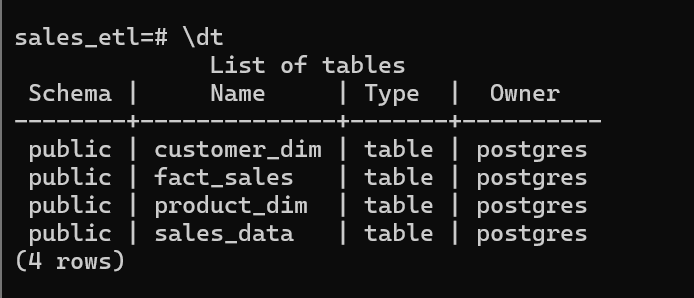
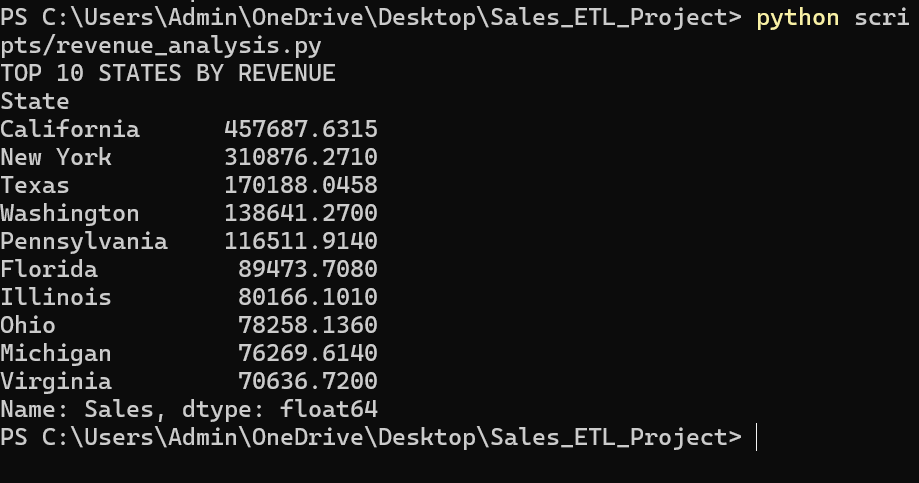
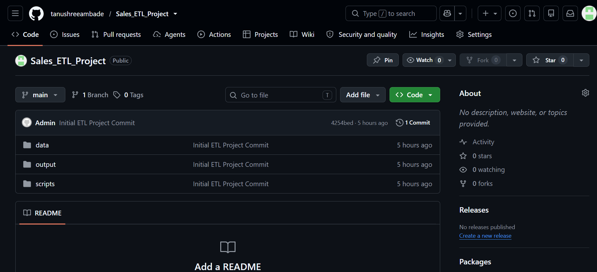
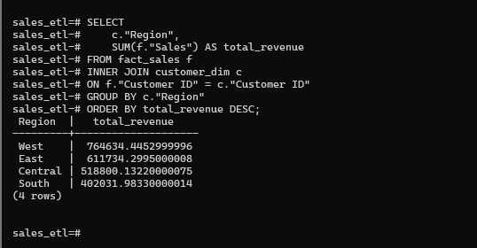
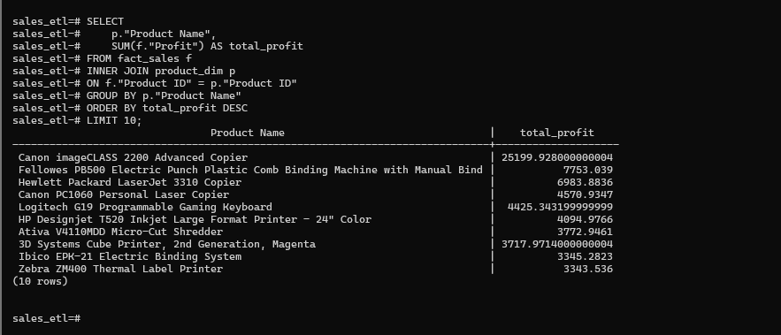

# Sales ETL Project

## Author
**Tanushree Ambade**

## Project Overview

This project demonstrates an End-to-End ETL (Extract, Transform, Load) pipeline using Python, Pandas, PostgreSQL, SQLAlchemy, and GitHub.

The project uses the Superstore Sales Dataset to perform:

- Data Cleaning
- Data Transformation
- Data Analysis
- PostgreSQL Database Loading
- Star Schema Modeling
- SQL Analytics

---

## Project Structure

```text
Sales_ETL_Project
│
├── data
│   └── Sample - Superstore.csv
│
├── output
│   ├── clean_sales.csv
│   ├── customer_dim.csv
│   ├── product_dim.csv
│   └── fact_sales.csv
│
├── scripts
│   ├── check_data.py
│   ├── data_profile.py
│   ├── transform_data.py
│   ├── revenue_analysis.py
│   ├── category_analysis.py
│   ├── customer_analysis.py
│   ├── star_schema.py
│   ├── load_to_postgres.py
│   └── load_star_schema.py
│
├── screenshots
│
└── README.md
```

---

## Technologies Used

- Python
- Pandas
- PostgreSQL
- SQLAlchemy
- Git & GitHub

---

## ETL Workflow

### 1. Extract

Loaded the Superstore dataset using Pandas.

### 2. Transform

Created new business metrics:

- Revenue
- Profit Margin

Performed:

- Data Cleaning
- Missing Value Checks
- Data Profiling

### 3. Load

Loaded cleaned data into PostgreSQL.

Table Created:

```sql
sales_data
```

---

## Star Schema Design

### Fact Table

```text
fact_sales
```

Columns:

- Order ID
- Customer ID
- Product ID
- Sales
- Quantity
- Discount
- Profit

### Dimension Tables

#### customer_dim

- Customer ID
- Customer Name
- Segment
- City
- State
- Region

#### product_dim

- Product ID
- Product Name
- Category
- Sub-Category

---

## Analysis Performed

### Top States by Revenue

| State | Revenue |
|---------|---------|
| California | 457,687 |
| New York | 310,876 |
| Texas | 170,188 |
| Washington | 138,641 |
| Pennsylvania | 116,511 |

---

### Category Revenue

| Category | Revenue |
|------------|------------|
| Technology | 836,154 |
| Furniture | 741,999 |
| Office Supplies | 719,047 |

---

### Regional Revenue

| Region | Revenue |
|---------|---------|
| West | 764,634 |
| East | 611,734 |
| Central | 518,800 |
| South | 402,031 |

---

### Top Customers by Profit

| Customer | Profit |
|-----------|-----------|
| Tamara Chand | 8,981 |
| Raymond Buch | 6,976 |
| Sanjit Chand | 5,757 |
| Hunter Lopez | 5,622 |
| Adrian Barton | 5,444 |

---

### Top Products by Profit

| Product | Profit |
|-----------|-----------|
| Canon imageCLASS 2200 Advanced Copier | 25,199 |
| Fellowes PB500 Binding Machine | 7,753 |
| HP LaserJet 3310 Copier | 6,983 |

---

## Monthly Sales Trend

SQL Query:

```sql
SELECT
    TO_CHAR(
        TO_DATE("Order Date", 'MM/DD/YYYY'),
        'YYYY-MM'
    ) AS month,
    SUM("Sales") AS total_sales
FROM sales_data
GROUP BY month
ORDER BY month;
```

### Key Observation

Highest monthly sales occurred in:

**November 2017 → $118,447.83**

---

## Database Verification

Verified:

```sql
SELECT COUNT(*) FROM sales_data;
```

Result:

```text
9994 Rows
```

---

## Screenshots

### PostgreSQL Tables



### Revenue Analysis



### GitHub Repository



### Regional Revenue Analysis



### Top Products by Profit



---

## Future Improvements

- Power BI Dashboard
- Tableau Dashboard
- Automated ETL Scheduling
- Data Warehouse Deployment
- Cloud Integration (AWS/GCP)

---

## Conclusion

This project demonstrates a complete ETL pipeline from raw data ingestion to database loading, dimensional modeling, and SQL analytics using industry-standard tools and practices.

---

